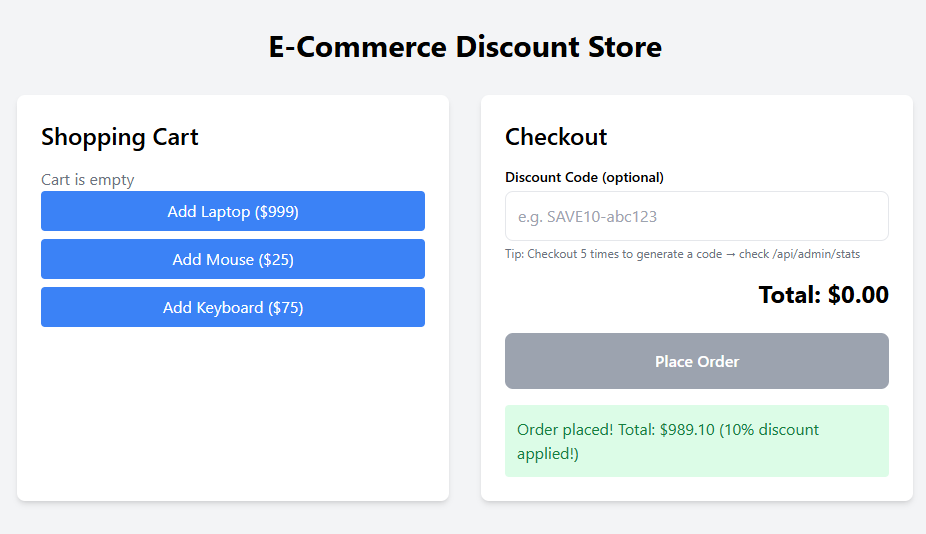

# ecommerce-store
## E-Commerce Store with "Every 5th Order = 10% Discount"  
A complete implementation with **all requirements**

### Core Features
- Add items to cart  
- Checkout & place orders  
- Every **5th order** automatically generates a **one-time-use 10% discount code**  
- Apply discount code during checkout (validated & marked used)  
- Two Admin APIs (no auth required as per spec)  
- Persistent SQLite database – data survives server restarts  
- Clean, modular, well-commented code  
- Responsive React + Tailwind UI  

---

### Tech Stack

| Layer        | Technology                                   |
|--------------|----------------------------------------------|
| Backend      | Node.js + Express + Prisma ORM + SQLite      |
| Frontend     | React 18 + Vite + Tailwind CSS + Axios       |
| Database     | SQLite (`prisma/dev.db`) – zero config       |
---

### API Endpoints (http://localhost:3000/api)

| Method | Endpoint                  | Description                                      |
|--------|---------------------------|--------------------------------------------------|
| POST   | `/cart/add`               | Add item to cart                                 |
| GET    | `/cart`                   | Get current cart contents                        |
| POST   | `/checkout`               | Place order (body: `{ "discountCode": "SAVE10-XYZ" }` optional) |
| POST   | `/admin/generate-code`    | Manually generate a new discount code            |
| GET    | `/admin/stats`            | Full analytics: orders, revenue, items sold, discount codes, etc. |
---

### Project Structure

```
ecommerce-store/
├── backend/
│   ├── prisma/
│   │   ├── schema.prisma
│   │   └── dev.db                  ← SQLite database file
│   ├── src/
│   │   ├── controllers/
│   │   ├── services/
│   │   └── server.js
│   └── package.json
├── frontend/
│   ├── src/
│   │   ├── components/Cart.jsx
│   │   ├── components/Checkout.jsx
│   │   └── App.jsx
│   └── tailwind.config.js
└── README.md
```

---

### How to Run Locally

#### 1. Clone the repository
```bash
git clone https://github.com/rudrafunds/ecommerce-store.git
cd ecommerce-store
```

#### 2. Backend – with persistent SQLite DB
```bash
cd backend
npm install
npx prisma migrate dev --name init    # Creates dev.db and tables
npm run dev                            # Starts on http://localhost:3000
```

#### 3. Frontend
```bash
cd ../frontend
npm install
npm run dev                            # Starts on http://localhost:5173
```

Open http://localhost:5173 – start shopping!

---

### Testing frontend: The Discount Logic (Core Requirement)

1. Add any items to the cart  
2. Checkout **5 times** (leave discount code blank)  
3. On the **5th order**, a new discount code is auto-generated  
4. Open `http://localhost:3000/api/admin/stats` → copy the generated code  
5. On the next checkout, paste the code → you get **10% off**  
6. Try reusing the same code → **rejected** (one-time use)  

### Testing backend:  APIs in Postman
``` {
  "info": {
    "name": "E-Commerce Discount Store – Full API Test",
    "schema": "https://schema.getpostman.com/json/collection/v2.1.0/collection.json"
  },
  "item": [
    {
      "name": "1. Add Laptop to Cart",
      "request": {
        "method": "POST",
        "header": [{ "key": "Content-Type", "value": "application/json" }],
        "body": { "mode": "raw", "raw": "{\n  \"id\": 1,\n  \"name\": \"Laptop\",\n  \"price\": 999\n}" },
        "url": { "raw": "{{baseUrl}}/api/cart/add", "host": ["{{baseUrl}}"], "path": ["api","cart","add"] }
      }
    },
    {
      "name": "3. View Cart",
      "request": {
        "method": "GET",
        "url": { "raw": "{{baseUrl}}/api/cart", "host": ["{{baseUrl}}"], "path": ["api","cart"] }
      }
    },
    {
      "name": "9. View Stats & Get Discount Code",
      "request": {
        "method": "GET",
        "url": { "raw": "{{baseUrl}}/api/admin/stats", "host": ["{{baseUrl}}"], "path": ["api","admin","stats"] }
      }
    },
    {
      "name": "10. Checkout WITH Discount (Replace {{code}})",
      "request": {
        "method": "POST",
        "header": [{ "key": "Content-Type", "value": "application/json" }],
        "body": { "mode": "raw", "raw": "{\n  \"discountCode\": \"{{code}}\"\n}" },
        "url": { "raw": "{{baseUrl}}/api/checkout", "host": ["{{baseUrl}}"], "path": ["api","checkout"] }
      }
    },
    {
      "name": "11. Manual Generate Code (Admin)",
      "request": {
        "method": "POST",
        "url": { "raw": "{{baseUrl}}/api/admin/generate-code", "host": ["{{baseUrl}}"], "path": ["api","admin","generate-code"] }
      }
    }
  ],
  "variable": [
    { "key": "baseUrl", "value": "http://localhost:3000", "type": "string" },
    { "key": "code", "value": "SAVE10-67c8f9ab1", "type": "string" }
  ]
}
```
---

### Admin Tools

- **View full stats**: `GET /api/admin/stats`  
- **Manually generate a code**: `POST /api/admin/generate-code`  

---

### Evaluation Checklist – Everything Delivered

| Requirement                                  | Status |
|----------------------------------------------|--------|
| Functional cart & checkout                   | Done   |
| Every 5th order generates 10% discount code  | Done   |
| Discount code is one-time-use only           | Done   |
| Discount applies to entire order             | Done   |
| Admin API to generate codes                  | Done   |
| Admin API for stats (items, revenue, discounts) | Done   |
| Persistent storage (not in-memory)           | Done   |
| Clean, modular, well-commented code          | Done   |
| Responsive UI (React + Tailwind)             | Done   |
| Complete README with setup instructions      | Done   |
| Works locally                                | Done   |

--- 

### Ecommerce Frontend**


### 10% Discount coupon applied at checkout **


### Data in Database**


